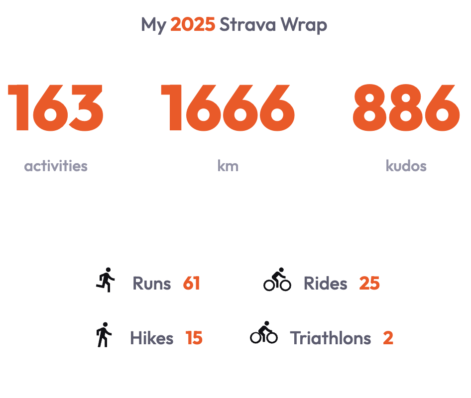
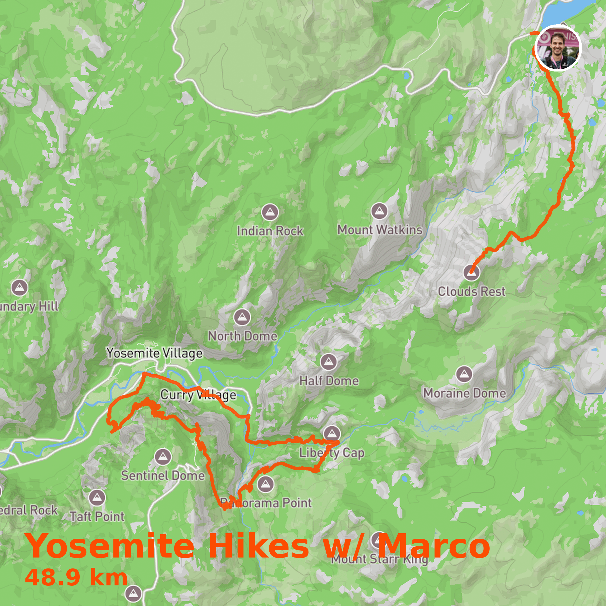

# Strava Wrapped

Generate beautiful, shareable maps of your Strava activities: your personal "year in review" visualization.

<p align="center">
  
  
</p>

## Features

- Beautiful map images of your activities with Mapbox styling
- Automatic clustering by location (e.g., "London Rides", "Paris Runs")
- Triathlon detection with color-coded swim/bike/run
- Interactive map customization (pan, zoom, style selection)
- Stats summary with activity counts, distance, kudos, and countries visited
- Download, copy, or share your generated images

## Quick Start

### 1. Clone & Install

```bash
git clone <your-repo-url>
cd strava_wrapped
python3 -m venv env
source env/bin/activate
pip install -e .
```

### 2. Get API Keys

#### Strava API
1. Go to [Strava API Settings](https://www.strava.com/settings/api)
2. Create an application (use `http://localhost:5001` as the callback URL)
3. Note your **Client ID** and **Client Secret**

#### Mapbox (for beautiful maps)
1. Create a free account at [Mapbox](https://www.mapbox.com/)
2. Copy your **Default public token** from the [Account page](https://account.mapbox.com/)

### 3. Configure Environment

Create a `.env` file:

```bash
STRAVA_CLIENT_ID=your_client_id
STRAVA_CLIENT_SECRET=your_client_secret
MAPBOX_ACCESS_TOKEN=your_mapbox_token
```

### 4. Run

```bash
python app.py
```

Open [http://localhost:5001](http://localhost:5001) and log in with Strava!

## How It Works

1. **Login** with your Strava account
2. **View** your activities automatically clustered by location
3. **Click** any cluster to generate a beautiful map image
4. **Customize** the map (optional): adjust zoom, pan, change style
5. **Download** or copy your image to share

## License

MIT
